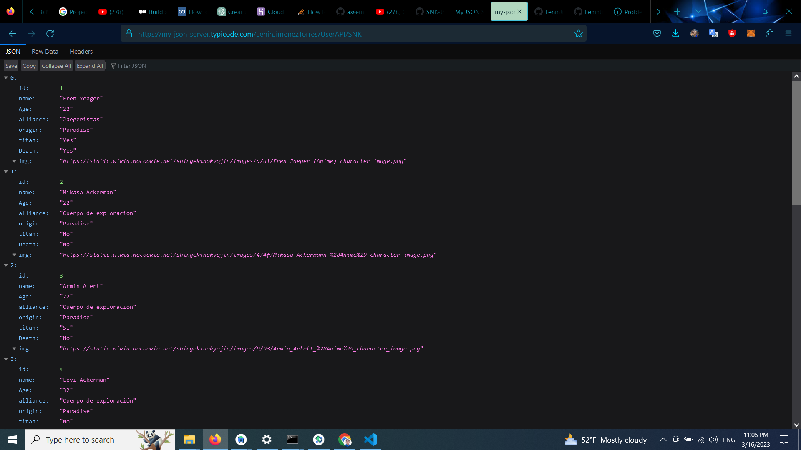

# NODEJS USER API

This is a siple API developed with ExpressJS - Node.js and deployed using the web tool 'my-json-server.typicode.com'

The deployment url address is available on:

https://my-json-server.typicode.com/LeninJimenezTorres/UserAPI/SNK

## Deployment and implementation

You can use it in a localserver by downloading the git reporitory and running the commands:

- npm install
- node index.js

### Note
This API will be used in some projects in this profile.

#### Author
Lenin Jimenez Torres
